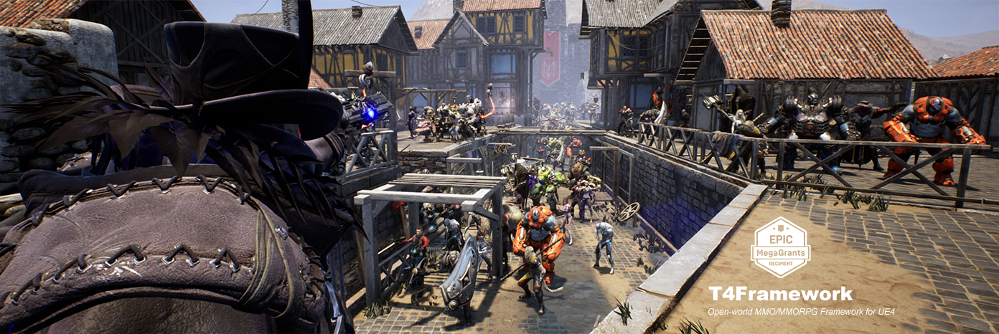

# T4FrameworkPlugin (v0.9.98)
### The Most Powerful MMO Action RPG Framework for UE4

- **지원정보**
  - Supported Engine Versions
    - 4.25 (Release Version : 4.25.3)
  - Windows, Android (Oculus Quest)
- **라이선스**
  - 별도의 안내 시까지 베타 테스트로 운영됩니다.
- **업데이트**
  - **Milestone 7** (2020.07.06 ~ 2020.10.11)
    - https://tech4labs.com/T4Framework_Milestone7_Achieved/
  - **v0.9.98** : 2020.10.18
	- #172 [기능개선] Content Editor, GameProject 기반으로 리뉴얼
	  - 기존 ContentBuildAsset 이 GameProjectAsset 으로 변경됨
	  - GameProject 가 사용하는 GameDB(ProjectGameName)을 설정할 수 있도록 추가
	  - SpawnLayer 가 사용하는 MapEntityAsset 을 별도로 설정할 수 있도록 추가
	  - SpawnLayer 선택 시 자동으로 설정된 MapEntityAsset 의 레벨로 이동 기능 추가
	- #172 [기능개선] Content Editor, GameDB List 의 복수의 선택 아이템에 대한 Copy&Paste 기능 추가
	- #172 [버그수정] Content Editor, GameDB 의 GameDBKey 를 리네임 했을 경우 PIE 또는 에디터 뷰포트에 스폰된 캐릭터에서 발생하는 크래시 수정
	- #172 [버그수정] Content Editor, NPC GameDB Detail 에서 EntityAsset 변경이 Preview 에 반영되지 않던 문제 수정
  - 이전 업데이트
    - [Update History](./UpdateHistory.md)
- **참고영상**
  - https://www.youtube.com/channel/UCoVNwMxu9CUzc92zGYN4l6A
- **문의**
  - SoonBo Noh : <niceofer@hotmail.com>
  - <https://tech4labs.com>
